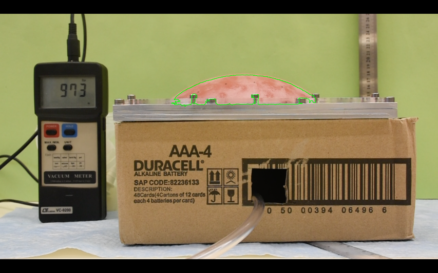
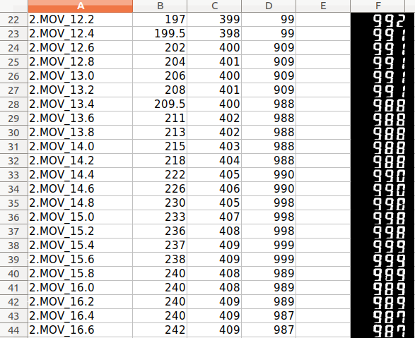

# Extracting Balloon Size & Pressure Meter Readings from Videos
&nbsp;

&nbsp;
&nbsp;

A friend wanted to extract some measurings for her advanced Physics lab course from several types of videos, so I wrote a simple program for her that extracts frames from a video, measures the height of the balloon and reads the different meters, finally saving it to an excel file.

&nbsp;

&nbsp;

Getting the size of the balloon was not that difficult. I created a mask of it by transforming to HSV space and choosing all red pixels, and then used that mask to find a contour. I used some online tutorial to extract the bounding rectangle of that contour and measure its height and width.

&nbsp;

&nbsp;

Reading the numbers from the LED screen was a bit more challenging. I first tried to use OCR to read it (the English tesseract model, and then also a tesseract model trained on the "Let's Go Digital" font) but it really didn't work well. So I then used a tutorial on reading digits from digital displays that extracts features for each digit. It worked better, but still not perfect. Because this was just a favor, I didn't want to get too carried away so I just saved all the data to excel, including a picture of the number, so that it could be also validated & fixed manually.

&nbsp;

&nbsp;

